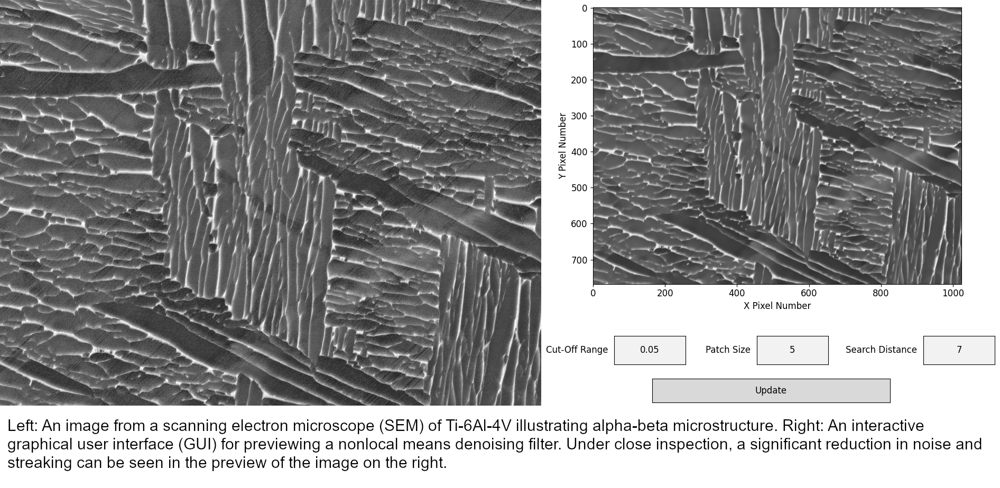
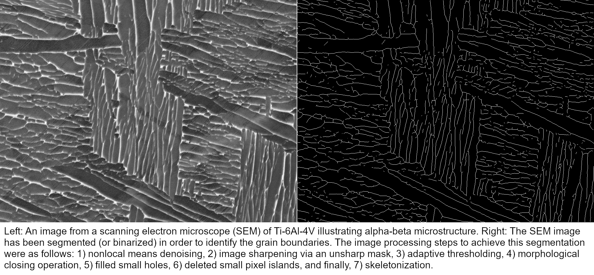
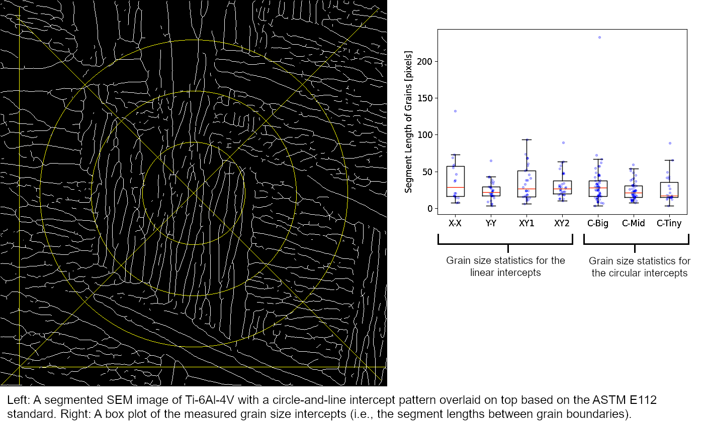
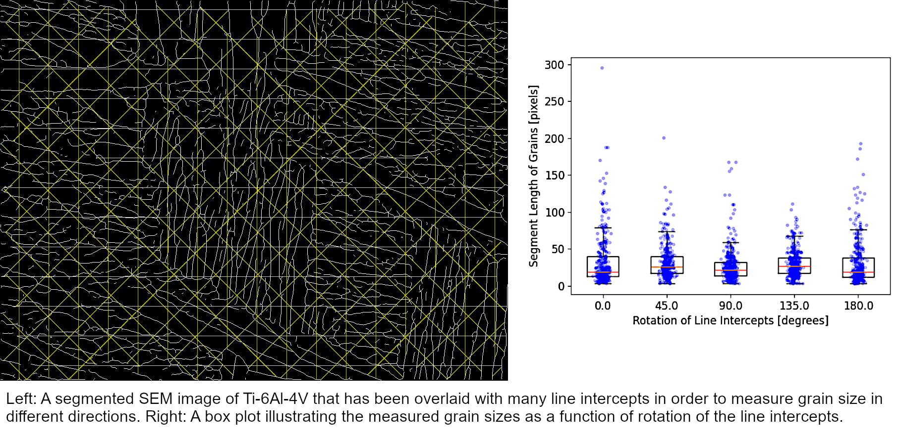

# Grain Size Analysis Tools (GSAT)

Accelerate and automate the process of segmenting images of microscopic 
(metallic) grain boundaries, as well as measuring grain sizes using intercept
methods.

Keywords: grain size, python, segmentation, image processing

## Overview

The Grain Size Analysis Tools (GSAT) is a set of Python scripts that provides tools to segment and measure metallic grains, which are traditionally observed in metals with an optical microscope after polishing and etching a metal sample. Additionally, microstructures measured using common scanning electron microscope (SEM) techniques are also suitable for this library, as will be shown below. Historically, measuring grain size has been a manual process where an experimentalist counts grains or grain boundary intersections. In present day, there are automated solutions, many of which require specialized microscropes and/or commercial software. While computational algorithms are mentioned in the literature related to automating the process of measuring grain size, there is scant open-source software available to the public that performs this process. The GSAT aims to fill this niche by providing free and open-source software (FOSS) that offers batch image processing specific to measuring metallic grain sizes. After choosing appropriate parameters, hundreds of images can be automatically processed using batch scripts in just minutes.

The GSAT separates the process of measuring grain size into two steps: 1) the first step is to segment (or binarize) the selected microstructure image in order to isolate the grain boundaries, and 2) the second step is to calculate various statistics about the grain sizes of a segmented microstructure image using one of two types intercept patterns. Examples of scripts that demonstrate how to segment an image, either interactively or as a batch command, can be found in the examples folder, "ex_segmentation". Additionally, the "ex_grain_intercept" folder contains examples of scripts that calculate grain sizes using different intercept patterns, which are described in more detail in [ASTM E112](https://www.astm.org/standards/e112).

## Example of Segmentation and Grain Size Measurement

An example of segmenting an image and measuring grain size using the GSAT is shown next; this example, and the scripts used to calculate the results, can also be found in the example folders: "ex_segmentation" and "ex_grain_intercept". The image chosen for this example was taken using backscatter electrons (BSE) via a scanning electron microscope (SEM). The microstructure corresponds Ti-6Al-4V, which is an alpha-beta titanium alloy.

The first step is to segment the image and isolate the grain boundaries. This can be done either interactively or using batch processing. In general, the interactive image processing script will be easier to find good segmentation parameters when processing an image for the first time. Afterwards, if there are more images taken with the same nominal measurement parameters, the same segmentation parameters will usually be acceptable. Therefore, the remaining images can be safely segmented using a batch processing script. 

The original SEM image of the Ti-6Al-4V microstructure is shown below. Alongside the SEM image is a screenshot of one of the interactive graphical user-interfaces (GUI) used in the process of segmenting the image. In this case, the interactive GUI corresponds to a nonlocal means denoising filter that removes noise and streaking throughout the SEM image. 

The final segmentation of the Ti-6Al-4V image is shown below; the grain boundaries are denoted by white pixels while everything is black. This segmentation was achieved using seven image processing steps: 1) nonlocal means denoising, 2) image sharpening via an unsharp mask, 3) adaptive thresholding, 4) a morphological closing operation, 5) filling small "holes", 6) removing small islands of pixel, and 7) skeletonization. In this example, each step of the segmentation process was done using an interactive GUI. In general, additional or fewer steps can be utilized as needed.  

After segmentation, the next step was to overlay the binarized image with an intercept pattern and calculate the intersections between the pattern and the grain boundaries. Currently, two patterns are available in GSAT: 1) the first is a circle-based intercept pattern based on ASTM E112, and 2) the second is a gridded line pattern. Examples of both of these intercept patterns are shown below. Specifically for the gridded line pattern, the user has full control over the range of angles of the lines which simplifies the process of analyzing grain sizes as a function of rotation (i.e., grain size anisotropy).

The provided example scripts in "ex_grain_intercept" will save the overlaid intercept pattern in a new image so that the user can verify that the pattern is acceptable for his or her needs. Furthermore, every intercept (i.e., line segment) between grain boundaries is recorded and saved in a .csv file. The user can then perfrom a more detailed statistical analysis of the grain size distribution, if needed. 

## Installation

The GSAT is a Python library is dependent on existing libraries like Numpy, SciPy, and SciKit-Image. The list of specific dependencies, and how to install them in a Python environment, are described in the ReadMe file found in the "dependencies" folder. 

There are also a number of custom Python modules that the GSAT also depends on which are located in the "imppy3d_functions" folder. At the top of each Python script, there is a line of code that adds a system path string to the system that points to the "imppy3d_functions" folder,

  `sys.path.insert(1, '../../imppy3d_functions')`

If the provided scripts are moved to a new directory relative to the "imppy3d_functions" folder, be sure to also update this path variable to the new relative location of the "imppy3d_functions" folder.

## Support
If you encounter any bugs or unintended behavior, please create an "Issue" and report a bug. You can also make a request for new features in this way. 

For questions on how best to use GSAT for a specific application, feel free
to contact Dr. Newell Moser (see below).

## Author

### Lead developer: 
* Dr. Newell Moser, NIST (newell.moser@nist.gov)
